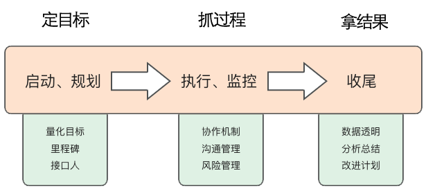
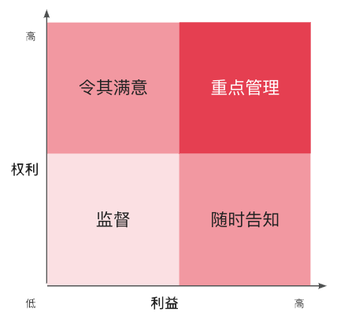

# 项目管理

<u>项目管理</u>是指在项目活动中运用专门的知识、技能、工具和方法，使项目能够在有限资源限定条件下，实现或超出设定需求和期望的过程。

<u>项目经理</u>是项目管理的执行者和领导者，负责项目的全面管理和实施。

## 项目管理过程

项目管理过程分为三大阶段和五大过程。

**三大阶段**：定目标、抓过程、拿结果 
**五大过程**：启动、规划、执行、监控、收尾

### 定目标：启动、规划

背景：想项目所有参与者讲解项目背景 
目标：明确项目目标，满足 SMART 原则，可衡量，可量化，有挑战性 
分工：任务拆解成不同模块，遵循“专业度 + 配合度”原则，为每个模块设立一个接口人 
里程碑：制定项目里程碑

### 抓过程：执行、监控

协作沟通机制、风险管理以及干系人管理，保证项目按时保质上线 
秉持两个基本原则：信息透明、敢于沟通

### 拿结果：收尾

项目上线后要及时进行复盘总结，一方面对比成果与目标的差距，一方面经验复盘供以后参考。

## 干系人管理

所有与项目相关的人员都是干系人。

### 识别干系人

首先，要识别项目中的每一个干系人； 
然后，按照四象限法则分析并管理干系人的期望。

权利、利益越高的人，越会影响整个项目的进展

- 第一象限——权利高、利益高——重点管理
- 第二象限——权利高、利益低——令其满意
- 第四象限——权利低、利益高——随时告知项目进展
- 第三象限——权利低、利益低——监督管理

### 管理目标和动作

| 项目周期 | 管理目标                                                                                      | 关键动作        |
| -------- | --------------------------------------------------------------------------------------------- | --------------- |
| 启动阶段 | 1、识别项目关系人 2、分组、归类；找出关键干系人 3、分析干系人对项目的影响、期望和诉求 | 组织一次有效 KO |
| 规划阶段 | 规划干系人管理策略、管理计划和责任人                                                          | 建立沟通机制    |
| 执行阶段 | 动态、实时监控项目干系人对项目的影响                                                          |                 |
| 监控阶段 | 按照规划好的干系人管理策略，不间断的管理                                                      |                 |
| 收尾阶段 | 与干系人确认最终结果与期望是否一致                                                            |                 |

### 项目 KO

KO 的目的：让项目干系人了解项目背景、明确项目目标、清楚项目范围、理解干系人之间的边界、熟知项目 Deadline 及风险、明确各方沟通机制。

KO 就是战前总动员，强调项目重要性、定军心；统一目标，增强团队荣誉感，明确排兵布阵。KO 会通常离不开干系人的现场支持，尤其是大项目、上层给予信心的同时，也无形中给与了项目团队成员压力，让压力得以在项目团队内共享共担。

组织 KO 的步骤：

1. PM 或一号位准备 KO 资料，包括：汇报材料、会议议程（Rundown）、拟参会人员名单等；
2. 确定 KO 时间、地点、参会人员，发出会议邀请函（包括会议议程、会议目标）；
3. 会场布置，可以准备些水果，可以进行视频直播；
4. 进行项目汇报介绍，内容包括：项目背景、项目目标、项目方案、里程碑计划、排兵布阵，也可以增加项目沟通机制、初步项目风险识别清单、项目职责矩阵、下阶段项目工作任务布置等；
5. 关键干系人发言，鼓舞项目团队士气，激励项目团队成员充分充分项目工作；
6. 项目提问和风险收集环节：与会人员对项目的疑难点进行提问，PM 或一号位进行澄清与答疑，现场不能解答的，可以记录下来，会后确认。

需要注意的是：项目 KO，主要目的是信息同步，而不是讨论。建议控制在 1 个小时以内，因此一些需要与会各方认可或承诺的事宜，需要在启动会前沟通清楚，否则会严重影响 KO 效果。一个好的 KO 是项目成功的一半。

### 沟通机制

沟通机制包括：双周通报会、项目周会、站立会等。

## 风险管理

风险无处不在，最大限度降低风险可能

### 识别风险

任何威胁到“按时”、“保质”的问题都可以被视为风险：

- 进度风险：任何可能威胁到项目里程碑节点的问题
- 质量风险：产品逻辑错误、开发质量、测试用例覆盖不完整，场景考虑不周全等

### 应对风险

应对风险的四种方式：规避、转移、减轻、接受

- 规避：更换计划、设计等
- 转移：讲风险转移给第三方（通常是付费的）
- 减轻：降低风险发生可能性和影响程度
- 接受：消极接受和积极接受；积极接受，做好应急方案

一切应对方式的目的是保证项目上线，PM 必须清楚所有威胁到项目上线的风险因素，并加以评估。项目中会有站会、周报等各种沟通的渠道和手段，当可能的风险出现时，必须要及时传递出去，将风险可能带来的影响控制在最小。
